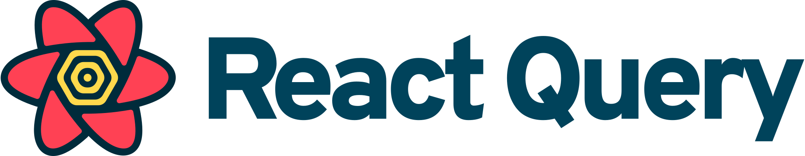

 
 
 
## Um Projeto, com utilização dos hooks useQuery , UseMutation

## 🛠️ Construído com

* [React] - O framework web usado

## 📄 Licença

Este projeto está sob a licença (Livre e Gratuita) 

## 🎁 Expressões de gratidão

* Conte a outras pessoas sobre este projeto 📢;
* Convide alguém da equipe para uma cerveja 🍺;

 Acesse o Projeto: 🚀  <a href="https://projetotodolist.vercel.app/" target="_blank">Projeto Lista com useQuery</a>
